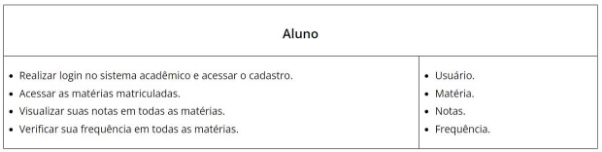
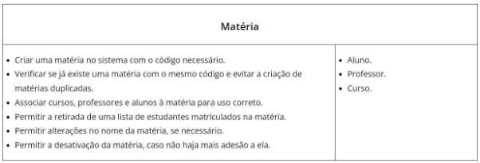
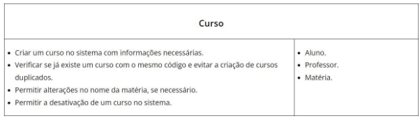
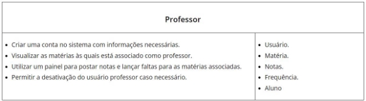
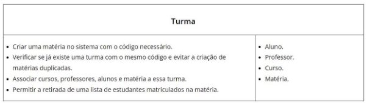

***História de Usuário 1: Cadastro e Utilização do Usuário Aluno***

Nome: Aluno

Função: Criar um aluno no sistema e usar todas as funcionalidades.

História: Como aluno, desejo acessar o sistema da faculdade com meu cadastro único e ter acesso às minhas notas e frequências do semestre. Além disso, é essencial que seja possível adicionar às minhas matérias do semestre. Dessa forma, o sistema me ajudará a acompanhar meu progresso acadêmico e saber se estou indo bem ou se preciso melhorar em alguma matéria.

**Critérios de Aceitação:**

1- O sistema deve permitir que o usuário Aluno crie uma conta com as informações necessárias, incluindo nome,sobrenome, e-mail, idade e sexo.

2- O aluno deve ser capaz de adicionar as matérias do seu semestre ao seu perfil, fornecendo o nome da matéria e o nome do professor.

3- O sistema deve exibir as notas obtidas pelo aluno em cada matéria cadastrada. As notas devem ser apresentadas de forma clara e organizada.

4- O aluno deve ser capaz de visualizar o número de faltas registradas em cada matéria. O sistema deve apresentar as informações de faltas de maneira acessível.

5- O aluno deve ser capaz de acompanhar seu progresso acadêmico, verificando as notas e as faltas regularmente. O sistema deve garantir que essas informações estejam sempre atualizadas e disponíveis para o aluno.

**Cartão CRC:**

- Classe: Aluno
- Responsabilidades:
  - Realizar login no sistema acadêmico e acessar o cadastro.
  - Acessar as matérias matriculadas.
  - Visualizar suas notas em todas as matérias.
  - Verificar sua frequência em todas as matérias.
- Colaborações:
1. Usuário.
1. Matéria.
1. Notas.
1. Frequência.

***História de Usuário 2: Cadastro e Adesão à Matérias***

Nome: Matéria

Função: Criar e associar as matérias no sistema.

História: O sistema precisa ter matérias para associar os alunos àquela devida graduação. Com isso, é necessário que esse curso tenha código e para comportar e atender todos os estudantes inscritos nele. Nisso, cada matéria tem que ter cursos, professores e alunos associados para ser utilizada de maneira correta e, além disso, o sistema não deve permitir que o aluno se matricule em matérias que necessitam de pré requisitos, os quais ele não tenha concluído.

**Critérios de Aceitação:**

1- O sistema deve permitir que seja criado uma matéria com o código necessário.

2- O sistema tem que ser capaz de bloquear uma matéria caso já tenha sido criado ou tenha um código igual.

3- O sistema tem que permitir a retirada de uma lista de estudantes matriculados nessas matérias.

4- O sistema tem que permitir que haja alterações nesta matéria caso for necessário: alterar seu nome.

5- O sistema tem que permitir a desativação desta matéria caso percebam que não há mais adesão à ela.

**Cartão CRC:**

- Classe: Matéria
- Responsabilidades:
  - Criar uma matéria no sistema com o código necessário.
  - Verificar se já existe uma matéria com o mesmo código e evitar a criação de matérias duplicadas.
  - Associar cursos, professores e alunos à matéria para uso correto.
  - Permitir a retirada de uma lista de estudantes matriculados na matéria.
  - Permitir alterações no nome da matéria, se necessário.
  - Permitir a desativação da matéria, caso não haja mais adesão a ela.
- Colaborações:
1. Aluno.
1. Professor.
1. Curso.

***História de Usuário 3: Cadastro e Modificação do Curso***

Nome: Curso

Função: Criar um curso no sistema da faculdade.

História: O sistema precisa ter cursos para associar os alunos àquela devida graduação. Com isso, é necessário que esse curso tenha e-mail, código e todos aparatos para comportar e atender todos os estudantes inscritos nele. Com a era digital, vários cursos estão deixando de existir ou se recriando, ou seja, é necessário poder desativar esse curso.

**Critérios de Aceitação:**

1- O sistema deve permitir que seja criado um curso com as informações necessárias, incluindo nome, e-mail e código.

2- O sistema tem que ser capaz de bloquear o curso caso já tenha sido criado ou tenha um código igual.

3- O sistema tem que permitir a desativação desse curso caso percebam que não há mais adesão à ele e que esse curso.

**Cartão CRC:**

- Classe: Curso
- Responsabilidades:
  - Criar um curso no sistema com informações necessárias.
  - Verificar se já existe um curso com o mesmo código e evitar a criação de cursos duplicados.
  - Permitir alterações no nome da matéria, se necessário.
  - Permitir a desativação de um curso no sistema.
- Colaborações:
4. Aluno.
4. Professor.
4. Matéria.

***História de Usuário 4: Cadastro e Utilização do Usuário Professor***

Nome: Professor

Função: Criar um professor no sistema e usar todas as funcionalidades.

História: Como professor, é desejável acessar o sistema da faculdade para cadastrar um usuário com as informações necessárias. Deve ser possível, pelo sistema, fazer retirada da lista de professores que utilizam a plataforma, atualizar os dados do professor, verificar e alterar as matérias lecionadas e lançar notas e presenças dos alunos. Ademais, a possibilidade da desativação do usuário de professores é necessária.

**Critérios de Aceitação:**

1- O sistema deve permitir que o usuário Professor crie uma conta com as informações necessárias, incluindo nome,sobrenome, e-mail, idade.

2- O professor deverá ver a quais matérias ele está associado.

3- O sistema deve exibir um painel para postar notas e lançar faltas.

4- O sistema tem que permitir a desativação desse professor caso haja a retirada dele.

**Cartão CRC:**

- Classe: Professor
- Responsabilidades:
  - Criar uma conta no sistema com informações necessárias.
  - Visualizar as matérias às quais está associado como professor.
  - Utilizar um painel para postar notas e lançar faltas para as matérias associadas.
  - Permitir a desativação do usuário professor caso necessário.
- Colaborações:
1. Usuário.
1. Matéria.
1. Notas.
1. Frequência.
1. Aluno

***História de Usuário 5: Organização de Turmas***

Nome: Turma

Função: A organização de alunos nas turmas de cada uma das matérias do sistema. História: O sistema precisa ter organizado a quantidade de alunos e a organização de cada aluno em cada matéria. Com isso, é essencial a criação de turmas. Nisso, é necessário que seja possível a listagem de alunos e professor daquele grupo, além da possibilidade da atualização desse.

**Critérios de Aceitação:**

1- O sistema deve permitir que seja criada uma turma com o código necessário.

2- O sistema tem que ser capaz de bloquear uma turma caso já tenha sido criado ou tenha um código igual.

3- O sistema tem que permitir a retirada de uma lista de estudantes matriculados nessas turmas com seu devido professor.

4- O sistema tem que permitir que haja alterações nesta matéria caso for necessário: alterar o professor ou algum aluno.

**Cartão CRC:**

- Classe: Turma.
- Responsabilidades:
  - Criar uma matéria no sistema com o código necessário.
  - Verificar se já existe uma turma com o mesmo código e evitar a criação de matérias duplicadas.
  - Associar cursos, professores, alunos e matéria a essa turma.
  - Permitir a retirada de uma lista de estudantes matriculados na matéria.
- Colaborações:
1. Aluno.
1. Professor.
1. Curso.
1. Matéria.

